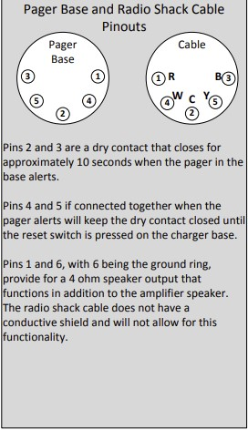

# NeoPixel Wiring with Motorola Minitor-V Accessory Port

### Wiring Instructions

#### Motorola Minitor-V Accessory Port (5 Pin DIN connector)
- Pin 2 → KB2040 D0 pin  
- Pin 3 → KB2040 Ground Pin  

#### NeoPixel RGBW LED Lights (3 wired in series)
- KB2040 D10 → NeoPixel DIN  
- KB2040 3.3V → NeoPixel V+  
- KB2040 GND → NeoPixel GND  

---

### Motorola Minitor V DIN Pin out

